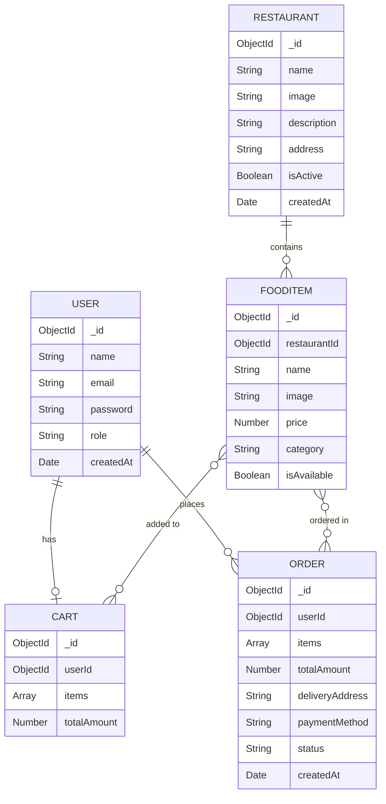

# 🍔 Food Express — Full-Stack Food Delivery Application

> A production-ready, full-stack food delivery web application built with the **MERN stack** (MongoDB, Express.js, React, Node.js), featuring role-based access control, cloud image hosting, a complete CI/CD pipeline, and containerized deployment on AWS EC2.

---

## 📌 Problem Statement

In the modern era of digital services, customers expect a seamless and convenient way to browse restaurant menus, place food orders, and track deliveries in real time — all from a single platform. Traditional food ordering via phone calls or in-person visits is time-consuming, error-prone, and lacks transparency in order tracking.

**Food Express** addresses this gap by providing a unified web-based platform that connects customers with restaurants through an intuitive digital interface. The system enables customers to browse multiple restaurants, explore categorized menus, manage a shopping cart, and place orders with real-time status tracking. Simultaneously, it empowers administrators to manage restaurants, food items, and order fulfillment through a dedicated admin panel.

---

## 🎯 Objectives

1. **Design and develop a full-stack web application** using the MERN stack that enables users to browse restaurants, view menus, and place food orders online.
2. **Implement secure user authentication and authorization** using JSON Web Tokens (JWT) with role-based access control (User and Admin roles).
3. **Build a comprehensive admin panel** for restaurant management, food item CRUD operations, and real-time order status management.
4. **Integrate cloud-based image hosting** using Cloudinary for professional storage and delivery of restaurant and food item images.
5. **Implement a shopping cart and checkout system** with support for multiple payment methods (Cash on Delivery and Online Payment).
6. **Containerize the application** using Docker and Docker Compose for consistent development and production environments.
7. **Establish a CI/CD pipeline** using GitHub Actions for automated building, pushing Docker images to DockerHub, and deploying to AWS EC2.
8. **Deploy the application to the cloud** on an AWS EC2 instance with Nginx as a reverse proxy for the frontend.

---

## 🛠️ Tech Stack

### Frontend
| Technology          | Purpose                                            |
| ------------------- | -------------------------------------------------- |
| **React 19**        | UI library for building component-based interfaces |
| **React Router v7** | Client-side routing and navigation                 |
| **Tailwind CSS v4** | Utility-first CSS framework for responsive styling |
| **Vite 7**          | Fast build tool and development server             |
| **Axios**           | HTTP client for REST API communication             |
| **Lucide React**    | Modern icon library                                |
| **React Icons**     | Additional icon support                            |

### Backend
| Technology             | Purpose                                                     |
| ---------------------- | ----------------------------------------------------------- |
| **Node.js**            | JavaScript runtime environment                              |
| **Express.js v5**      | Web framework for building RESTful APIs                     |
| **MongoDB**            | NoSQL database for data persistence                         |
| **Mongoose v9**        | ODM library for MongoDB schema modeling                     |
| **JWT (jsonwebtoken)** | Secure token-based authentication                           |
| **bcryptjs**           | Password hashing and verification                           |
| **Cloudinary**         | Cloud-based image upload and storage                        |
| **Multer**             | Middleware for handling multipart/form-data (image uploads) |

### DevOps & Deployment
| Technology         | Purpose                                           |
| ------------------ | ------------------------------------------------- |
| **Docker**         | Containerization of frontend and backend services |
| **Docker Compose** | Multi-container orchestration                     |
| **Nginx**          | Reverse proxy and static file server for frontend |
| **GitHub Actions** | CI/CD pipeline for automated build and deployment |
| **AWS EC2**        | Cloud hosting for production deployment           |
| **DockerHub**      | Container image registry                          |

---

## 🏗️ System Architecture

```
┌─────────────────────────────────────────────────────────────────┐
│                        CLIENT (Browser)                         │
└──────────────────────────────┬──────────────────────────────────┘
                               │  HTTP Requests
                               ▼
┌──────────────────────────────────────────────────────────────────┐
│                     FRONTEND (React + Vite)                      │
│  ┌──────────┐ ┌────────────┐ ┌───────────┐ ┌─────────────────┐  │
│  │   Pages  │ │ Components │ │  Context  │ │    Services     │  │
│  │  (12)    │ │    (3)     │ │ Auth/Cart │ │   (Axios API)   │  │
│  └──────────┘ └────────────┘ └───────────┘ └─────────────────┘  │
│                Served via Nginx (Port 80)                        │
└──────────────────────────────┬──────────────────────────────────┘
                               │  REST API Calls (/api/*)
                               ▼
┌──────────────────────────────────────────────────────────────────┐
│                   BACKEND (Express.js API)                       │
│  ┌──────────┐ ┌──────────────┐ ┌────────────┐ ┌─────────────┐  │
│  │  Routes  │ │  Controllers │ │ Middleware │ │   Models    │  │
│  │  (5)     │ │     (5)      │ │ Auth/Error │ │    (5)      │  │
│  └──────────┘ └──────────────┘ └────────────┘ └─────────────┘  │
│                    Running on Port 5000                          │
└───────────────────┬────────────────────┬───────────────────────┘
                    │                    │
                    ▼                    ▼
          ┌─────────────────┐  ┌─────────────────┐
          │    MongoDB      │  │   Cloudinary    │
          │  Atlas (Cloud)  │  │ (Image Storage) │
          └─────────────────┘  └─────────────────┘
```

---

## 📂 Project Structure

```
Food-Booking-System/
├── .github/
│   └── workflows/
│       ├── ci.yml                 # CI pipeline — Build & push Docker images
│       └── cd.yml                 # CD pipeline — Deploy to AWS EC2
├── backend/
│   ├── config/
│   │   └── db.js                  # MongoDB connection configuration
│   ├── controllers/
│   │   ├── authController.js      # User registration & login logic
│   │   ├── cartController.js      # Cart CRUD operations
│   │   ├── foodController.js      # Food item management with image upload
│   │   ├── orderController.js     # Order placement & status updates
│   │   └── restaurantController.js# Restaurant CRUD with image upload
│   ├── middleware/
│   │   ├── authMiddleware.js      # JWT verification & admin authorization
│   │   └── errorMiddleware.js     # Global error handling
│   ├── models/
│   │   ├── Cart.js                # Cart schema (userId, items, totalAmount)
│   │   ├── FoodItem.js            # Food schema (name, price, category, image)
│   │   ├── Order.js               # Order schema (items, status, delivery info)
│   │   ├── Restaurant.js          # Restaurant schema (name, image, address)
│   │   └── User.js                # User schema with password hashing
│   ├── routes/
│   │   ├── authRoutes.js          # POST /register, /login
│   │   ├── cartRoutes.js          # GET, POST, PUT, DELETE cart operations
│   │   ├── foodRoutes.js          # CRUD for food items (admin-protected)
│   │   ├── orderRoutes.js         # Place orders, view history, update status
│   │   └── restaurantRoutes.js    # CRUD for restaurants (admin-protected)
│   ├── Dockerfile                 # Backend container configuration
│   ├── package.json
│   ├── seed.js                    # Database seeding script
│   └── server.js                  # Express app entry point
├── frontend/
│   ├── src/
│   │   ├── components/
│   │   │   ├── Footer.jsx         # Application footer
│   │   │   ├── Navbar.jsx         # Navigation bar with auth state
│   │   │   └── ProtectedRoute.jsx # Route guard for admin pages
│   │   ├── context/
│   │   │   ├── AuthContext.jsx    # Authentication state management
│   │   │   └── CartContext.jsx    # Shopping cart state management
│   │   ├── pages/
│   │   │   ├── Home.jsx           # Landing page with restaurant listings
│   │   │   ├── Login.jsx          # User login page
│   │   │   ├── Register.jsx       # User registration page
│   │   │   ├── RestaurantDetails.jsx # Menu display for a restaurant
│   │   │   ├── Cart.jsx           # Shopping cart management
│   │   │   ├── Checkout.jsx       # Order placement with address & payment
│   │   │   ├── Orders.jsx         # User order history & tracking
│   │   │   ├── AdminLogin.jsx     # Admin authentication
│   │   │   ├── AdminDashboard.jsx # Admin overview panel
│   │   │   ├── ManageRestaurants.jsx # Admin restaurant CRUD
│   │   │   ├── ManageFoods.jsx    # Admin food item CRUD
│   │   │   └── ManageOrders.jsx   # Admin order status management
│   │   ├── services/
│   │   │   └── api.js             # Axios instance with interceptors
│   │   ├── App.jsx                # Root component with routing
│   │   └── main.jsx               # Application entry point
│   ├── Dockerfile                 # Multi-stage build (Node → Nginx)
│   ├── nginx.conf                 # Nginx configuration
│   ├── tailwind.config.js
│   ├── vite.config.js
│   └── package.json
└── docker-compose.yml             # Multi-container orchestration
```

---

## ✨ Features

### 👤 User Module
- **Registration & Login** — Secure sign-up with encrypted passwords and JWT-based session management
- **Browse Restaurants** — View all active restaurants with images and descriptions
- **Explore Menus** — View categorized food items with prices and availability status
- **Shopping Cart** — Add, update quantity, and remove items with real-time total calculation
- **Checkout & Ordering** — Place orders with delivery address and payment method selection (COD / Online)
- **Order History & Tracking** — View all past orders with real-time status updates (Pending → Preparing → Out for Delivery → Delivered)

### 🔐 Admin Module
- **Admin Authentication** — Separate admin login with role-based route protection
- **Dashboard** — Overview panel for managing the entire platform
- **Restaurant Management** — Create, update, delete restaurants with Cloudinary image upload
- **Food Item Management** — Add/edit/delete food items per restaurant with image upload and category assignment
- **Order Management** — View all orders across the platform and update order status in real time

### ⚙️ Technical Features
- **JWT Authentication** — Stateless, token-based auth with Bearer token headers
- **Role-Based Access Control** — Middleware-level protection for admin-only routes
- **Cloudinary Integration** — Scalable cloud image hosting for restaurant and food images
- **Axios Interceptors** — Automatic token injection and 401 redirect handling
- **Context API** — Global state management for authentication and cart data
- **Protected Routes** — Client-side route guards for admin pages
- **Error Handling** — Centralized error middleware with custom error responses
- **CORS Configuration** — Configured for both local development and production origins

---

## 🔌 API Endpoints

### Authentication
| Method | Endpoint             | Description                 | Access |
| ------ | -------------------- | --------------------------- | ------ |
| POST   | `/api/auth/register` | Register a new user         | Public |
| POST   | `/api/auth/login`    | Login and receive JWT token | Public |

### Restaurants
| Method | Endpoint               | Description             | Access |
| ------ | ---------------------- | ----------------------- | ------ |
| GET    | `/api/restaurants`     | Get all restaurants     | Public |
| GET    | `/api/restaurants/:id` | Get restaurant by ID    | Public |
| POST   | `/api/restaurants`     | Create a new restaurant | Admin  |
| PUT    | `/api/restaurants/:id` | Update a restaurant     | Admin  |
| DELETE | `/api/restaurants/:id` | Delete a restaurant     | Admin  |

### Food Items
| Method | Endpoint                    | Description                  | Access |
| ------ | --------------------------- | ---------------------------- | ------ |
| GET    | `/api/foods/restaurant/:id` | Get food items by restaurant | Public |
| POST   | `/api/foods`                | Add a new food item          | Admin  |
| PUT    | `/api/foods/:id`            | Update a food item           | Admin  |
| DELETE | `/api/foods/:id`            | Delete a food item           | Admin  |

### Cart
| Method | Endpoint            | Description           | Access |
| ------ | ------------------- | --------------------- | ------ |
| GET    | `/api/cart`         | Get user's cart       | User   |
| POST   | `/api/cart`         | Add item to cart      | User   |
| PUT    | `/api/cart`         | Update item quantity  | User   |
| DELETE | `/api/cart/:itemId` | Remove item from cart | User   |

### Orders
| Method | Endpoint                 | Description              | Access |
| ------ | ------------------------ | ------------------------ | ------ |
| POST   | `/api/orders`            | Place a new order        | User   |
| GET    | `/api/orders`            | Get user's order history | User   |
| GET    | `/api/orders/all`        | Get all orders (admin)   | Admin  |
| PUT    | `/api/orders/:id/status` | Update order status      | Admin  |

---

## 🚀 Setup Instructions

### Prerequisites
- **Node.js** v18 or later
- **npm** v9 or later
- **MongoDB** Atlas account (or local MongoDB instance)
- **Cloudinary** account for image hosting
- **Docker & Docker Compose** (optional, for containerized setup)

### 1. Clone the Repository
```bash
git clone https://github.com/kavyareddy1313/FoodExpress.git
cd FoodExpress
```

### 2. Backend Setup
```bash
cd backend
npm install
```

Create a `.env` file in the `backend/` directory:
```env
PORT=5000
MONGODB_URI=your_mongodb_connection_string
JWT_SECRET=your_jwt_secret_key
CLOUDINARY_CLOUD_NAME=your_cloudinary_cloud_name
CLOUDINARY_API_KEY=your_cloudinary_api_key
CLOUDINARY_API_SECRET=your_cloudinary_api_secret
```

Start the backend server:
```bash
npm run dev       # Development mode (with nodemon)
npm start         # Production mode
```

### 3. Frontend Setup
```bash
cd frontend
npm install
```

Create a `.env` file in the `frontend/` directory:
```env
VITE_API_URL=http://localhost:5000
```

Start the frontend development server:
```bash
npm run dev
```

### 4. Docker Setup (Alternative)
Run the entire application using Docker Compose:
```bash
docker-compose up --build
```
- **Backend** will be available at `http://localhost:5000`
- **Frontend** will be available at `http://localhost:5173`

---

## 🔄 CI/CD Pipeline

The project uses **GitHub Actions** with a two-stage pipeline:

```
┌─────────────────┐         ┌──────────────────┐
│   CI Pipeline   │────────▶│   CD Pipeline    │
│ (Build & Push)  │         │ (Deploy to AWS)  │
└─────────────────┘         └──────────────────┘
```

### CI — Build and Push (`ci.yml`)
- **Trigger:** Push to `main` branch
- **Steps:**
  1. Checkout source code
  2. Set up Docker Buildx
  3. Login to DockerHub
  4. Build and push **backend** image → `kavya00/food-express-backend:latest`
  5. Build and push **frontend** image → `kavya00/food-express-frontend:latest`

### CD — Deploy to AWS (`cd.yml`)
- **Trigger:** Successful completion of CI pipeline
- **Steps:**
  1. SSH into AWS EC2 instance
  2. Generate `docker-compose.yml` on the server
  3. Install Docker if not present
  4. Pull latest images and restart containers
  5. Clean up unused images

---

## 📊 Database Schema (ER Diagram)



---

## 📚 Learning Outcomes

Through the development of this project, the following key learning outcomes were achieved:

1. **Full-Stack Development** — Gained hands-on experience in building a complete web application from scratch using the MERN stack, understanding how frontend and backend components interact through RESTful APIs.

2. **RESTful API Design** — Learned to design and implement a well-structured REST API with proper HTTP methods, status codes, route organization, and middleware-based request processing.

3. **Authentication & Security** — Implemented industry-standard security practices including JWT-based stateless authentication, password hashing with bcrypt, role-based access control, and protected route middleware.

4. **State Management** — Understood the use of React Context API for managing global application state (authentication and shopping cart) across multiple components without prop drilling.

5. **Cloud Service Integration** — Gained practical experience integrating third-party cloud services (Cloudinary for image management, MongoDB Atlas for database hosting) into a web application.

6. **Containerization with Docker** — Learned to containerize a multi-service application using Docker, write multi-stage Dockerfiles for optimized production builds, and orchestrate services with Docker Compose.

7. **CI/CD Pipeline Implementation** — Built an automated CI/CD pipeline using GitHub Actions that builds Docker images, pushes them to DockerHub, and deploys to an AWS EC2 instance — understanding the principles of continuous integration and continuous delivery.

8. **Cloud Deployment** — Gained experience deploying a containerized application to AWS EC2, configuring Nginx as a reverse proxy, and managing production environments.

9. **Responsive UI Design** — Developed a responsive, modern user interface using Tailwind CSS with mobile-first design principles, ensuring a consistent experience across devices.

10. **Software Engineering Practices** — Applied best practices including modular code architecture (MVC pattern), environment variable management, error handling middleware, and version control with Git.

---

## 📈 Results of the Project

### ✅ Functional Achievements
| Feature                            | Status      |
| ---------------------------------- | ----------- |
| User Registration & Login with JWT | ✅ Completed |
| Admin Authentication & Dashboard   | ✅ Completed |
| Restaurant CRUD with Image Upload  | ✅ Completed |
| Food Item CRUD with Image Upload   | ✅ Completed |
| Shopping Cart Management           | ✅ Completed |
| Order Placement with Checkout      | ✅ Completed |
| Real-time Order Status Tracking    | ✅ Completed |
| Role-Based Access Control          | ✅ Completed |
| Responsive UI with Tailwind CSS    | ✅ Completed |
| Docker Containerization            | ✅ Completed |
| CI/CD Pipeline (GitHub Actions)    | ✅ Completed |
| AWS EC2 Cloud Deployment           | ✅ Completed |

### 🏆 Key Outcomes
- **End-to-End Delivery:** Successfully built and deployed a complete food delivery platform covering the full software development lifecycle — from design to deployment.
- **Production-Ready Architecture:** Implemented a scalable MVC architecture with separation of concerns, making the codebase maintainable and extensible.
- **Automated Deployment:** Achieved zero-downtime deployments through a fully automated CI/CD pipeline that triggers on every push to the `main` branch.
- **Secure Platform:** Implemented multi-layered security with password hashing, JWT authentication, role-based middleware, and automatic session invalidation on token expiry.
- **Cloud-Native Deployment:** The application runs as containerized microservices on AWS EC2, demonstrating practical knowledge of modern cloud deployment practices.

### 🌐 Live Deployment
- **Frontend:** Deployed via Vercel — [food-express-silk.vercel.app](https://food-express-silk.vercel.app)
- **Backend API:** Hosted on AWS EC2 instance
- **Docker Images:** Published on DockerHub
  - `kavya00/food-express-backend:latest`
  - `kavya00/food-express-frontend:latest`

---

## 🧪 Testing the Application

### User Flow
1. **Register** → Navigate to `/register` and create a new account
2. **Login** → Login with your credentials at `/login`
3. **Browse** → Explore restaurants on the home page
4. **View Menu** → Click on a restaurant to see its food items
5. **Add to Cart** → Add desired items to your shopping cart
6. **Checkout** → Go to `/checkout`, enter delivery address, and select payment method
7. **Track Order** → View order status updates at `/orders`

### Admin Flow
1. **Admin Login** → Navigate to `/admin/login`
2. **Dashboard** → View platform overview at `/admin/dashboard`
3. **Manage Restaurants** → Add, edit, or delete restaurants at `/admin/restaurants`
4. **Manage Food Items** → Add food items to restaurants at `/admin/restaurants/:id/foods`
5. **Manage Orders** → Update order statuses at `/admin/orders`

---

## 🔑 Environment Variables Reference

### Backend (`backend/.env`)
| Variable                | Description                      |
| ----------------------- | -------------------------------- |
| `PORT`                  | Server port (default: 5000)      |
| `MONGODB_URI`           | MongoDB Atlas connection string  |
| `JWT_SECRET`            | Secret key for JWT token signing |
| `CLOUDINARY_CLOUD_NAME` | Cloudinary account cloud name    |
| `CLOUDINARY_API_KEY`    | Cloudinary API key               |
| `CLOUDINARY_API_SECRET` | Cloudinary API secret            |

### Frontend (`frontend/.env`)
| Variable       | Description          |
| -------------- | -------------------- |
| `VITE_API_URL` | Backend API base URL |

---

## 🤝 Contributing

1. Fork the repository
2. Create a feature branch (`git checkout -b feature/new-feature`)
3. Commit your changes (`git commit -m 'Add new feature'`)
4. Push to the branch (`git push origin feature/new-feature`)
5. Open a Pull Request

---

## 📄 License

This project is licensed under the **ISC License**.

